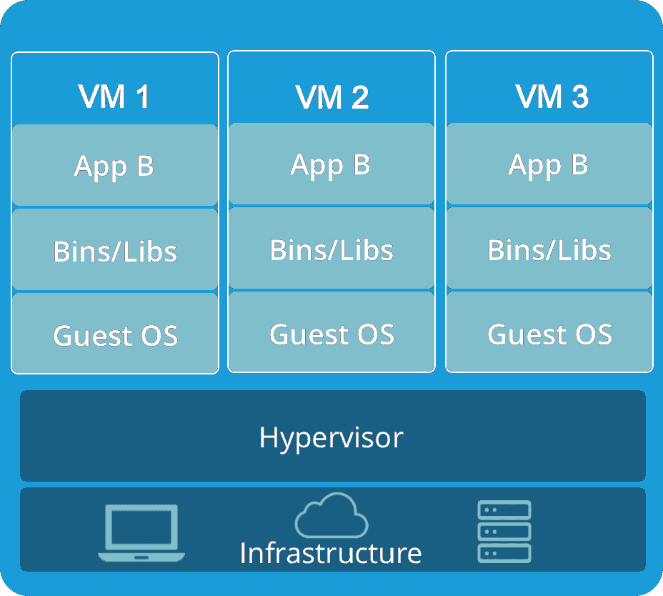
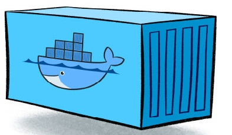
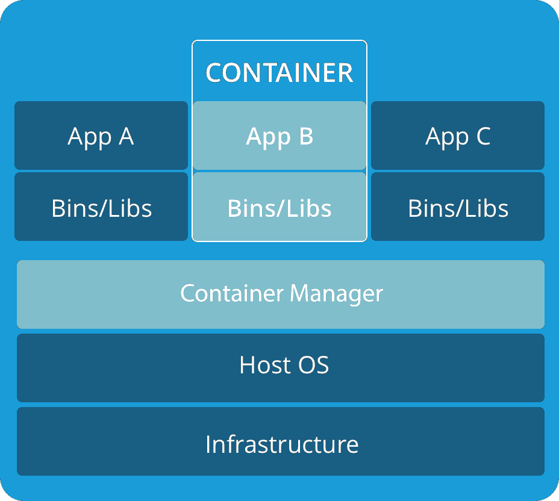
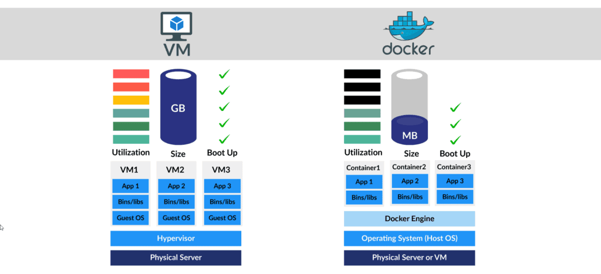

# 容器（Docker）与虚拟机（VM）的区别？

> **Note:** 注意我们这里所说的容器是指的一种技术，而Docker只是一个容器技术的实现，或者说让容器技术普及开来的最成功的实现

## 什么是虚拟机 (VM)

随着服务器处理能力和容量随着时间的推移而增加，裸机应用程序无法利用新的丰富资源。这导致了虚拟机的发明，它自然地解决了许多计算问题。虚拟机是模拟物理硬件或计算系统功能的软件程序。简单来说， VM 使得在单台计算机的硬件上运行看似多台独立的计算机成为可能。

VM 通过使用称为Hypervisor的轻量级软件层与物理计算机进行交互。这些虚拟机管理程序可以将虚拟机彼此分离，并在它们之间分配处理器、内存和存储。VM 还可能包含运行应用程序所需的系统二进制文件和库。主机操作系统 (OS) 使用管理程序进行管理和执行。裸机应用程序无法利用新的丰富资源。这导致了虚拟机的发明，它自然地解决了许多计算问题。虚拟机是模拟物理硬件或计算系统功能的软件程序。简单来说， VM 使得在单台计算机的硬件上运行看似多台独立的计算机成为可能。

## 虚拟机 (VM) 如何工作？

虚拟机架构可以分为四个不同的部分：

- 一个底层系统（硬件/基础设施），包括物理机及其操作系统。裸机管理程序在这一层不需要底层操作系统。
- 一个虚拟机管理程序，充当硬件和底层基础设施之间的中间人。
- 通过与管理程序通信来使用主机资源的多个虚拟机。
- 在每个来宾操作系统上运行的应用程序和进程。

## 虚拟机的优点

- 可以在同一台计算机上使用多个操作系统环境。
- VM 提高系统可靠性并防止系统崩溃。即使崩溃，主机操作系统也不会因为隔离而受到影响。
- 提供一层安全保护，如果虚拟机受到某些恶意软件的影响，它不会导致主机操作系统的安全性受到破坏。

## 虚拟机的缺点

- 运行多个虚拟机可能会导致输出不稳定。
- 与物理机相比，虚拟机效率较低且速度较慢。
- 虚拟机可能会感染主机的弱点。

## 什么是容器？

由于虚拟机的创建在降低成本和提高计算机效率方面带来了巨大的好处，因此大多数公司都开始使用它们。在 2020 年，可以说虚拟机的虚拟化理念也被利用和耗尽。

容器是操作系统虚拟化的一种形式。单个容器可用于运行从小型微服务或软件进程到大型应用程序的任何内容。它们是应用层的抽象，将代码和依赖项打包在一起。容器共享主机操作系统内核，通常还共享二进制文件和库。容器非常轻巧——它们只有几兆字节，启动只需几秒钟。

## 容器如何工作？

容器需要操作系统、支持程序和库以及运行特定程序的系统资源。在容器内工作时，您可以创建所需环境的模板。容器本质上是在特定时间运行系统快照，提供应用程序行为的一致性。

容器共享主机的内核以运行容器内的所有单个应用程序。每个容器需要的唯一元素是 bin、库和其他运行时组件

## 容器的优点

- 容器可以小至 10MB，您可以轻松限制它们的内存和 CPU 使用率。所以，它们是轻量级的。
- 由于它们体积小，它们可以更快地启动并且也可以快速扩展。
- 在持续集成和持续部署(CI/CD) 实施方面，容器堪称典范。

## 容器的缺点

- 由于容器在主机操作系统上运行，因此它依赖于主机底层主机操作系统。
- 容器本身不能提供值得称道的安全性。
- 当容器内的数据丢失时，容器被删除。您必须添加数据卷才能存储数据。

## 容器 (Docker) 与虚拟机 (VM)：差异

Container 和 VM 之间的主要区别在于，在 VM 中，管理程序用于虚拟化物理硬件。每个 VM 都包含一个来宾操作系统，即操作系统运行所需硬件的虚拟副本，而在容器中，它们不是虚拟化底层硬件，而是虚拟化操作系统，因此每个容器只包含应用程序及其库

1. 操作系统：虚拟机的客户操作系统在主机操作系统之上，这使得虚拟机很重。在 Docker 中，多个容器共享主机操作系统，这就是它们轻量级的原因。

2. 安全性：虚拟机不共享操作系统，主机内核有很强的隔离性。因此，与容器相比，它们更安全。Docker 存在很多安全风险和漏洞，因为容器共享主机内核。

3. 性能：容器轻量级，消耗资源少，而虚拟机重，消耗资源多，因此容器比虚拟机提供更好的性能。

4. 可移植性： 容器很容易移植，因为它们没有单独的操作系统。虽然虚拟机具有独立的操作系统，但移植虚拟机非常困难。

|                |容器                              |虚拟机 (VM)                         |
|---------------------|--------------------------|-----------------------------|
|开机时间             |几秒钟后启动。|VM 需要几分钟才能启动。|
|运行方式             |Docker 使用执行引擎。|VM 使用管理程序。|
|内存效率             |虚拟化不需要空间，因此内存更少。|在启动表面之前需要加载整个操作系统，因此效率较低。|
|隔离                 |由于没有隔离系统的规定，容易遇到逆境。|由于有效的隔离机制，干扰的可能性最小。|
|部署                 |部署很容易，因为只有一个镜像，容器化可以在所有平台上使用。|部署相对较长，因为单独的实例负责执行。|
|表现                 |性能有限|本机性能|

## 容器 (Docker) 与虚拟机 (VM)：哪个更好——最终裁决！

毕竟，您会想知道两者中哪个更好，对吗？好吧，我想说仅仅因为它们用于部署应用程序而将两者进行比较是不公平的。Docker 无疑在行业中占据了巨大的地位，但到目前为止，它还不是虚拟机的替代品。

此外，如今没有多少数字运营组织将虚拟机作为他们的主要选择，并且更喜欢迁移到使用容器，因为部署时间相对较长，并且运行微服务也是其面临的主要挑战之一。然而，仍然有一些公司更喜欢虚拟机而不是 Docker，他们对基础设施的企业级安全感兴趣。

我们可以看到，Docker 与 VM 并没有因为各种需求而发生冲突，我们都知道所有问题都没有统一的解决方案，所以完全取决于需求。

